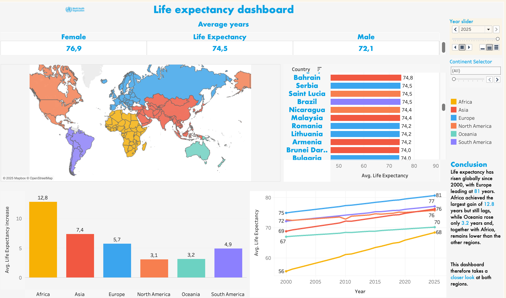
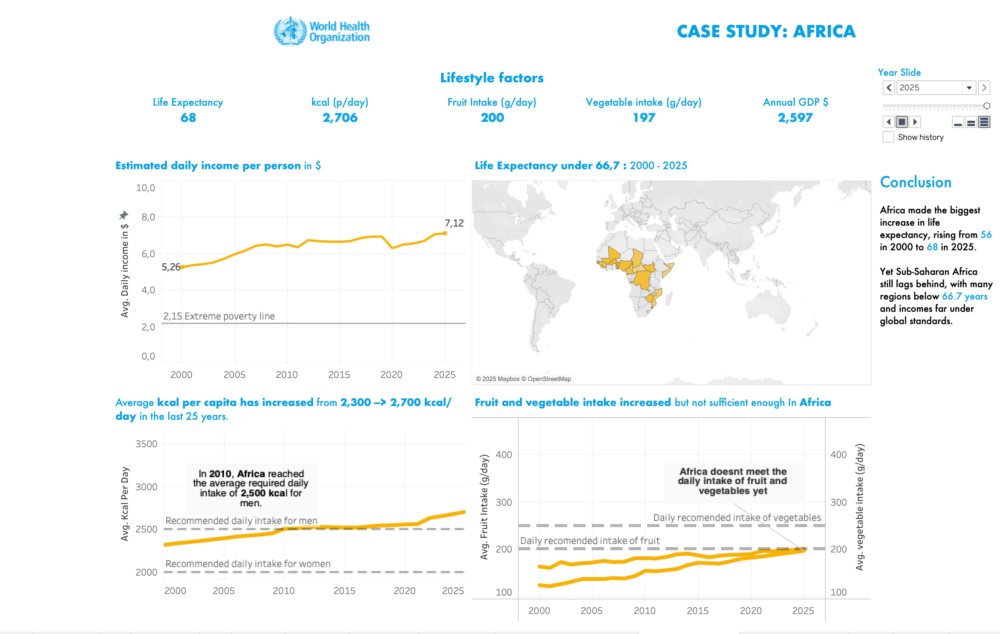
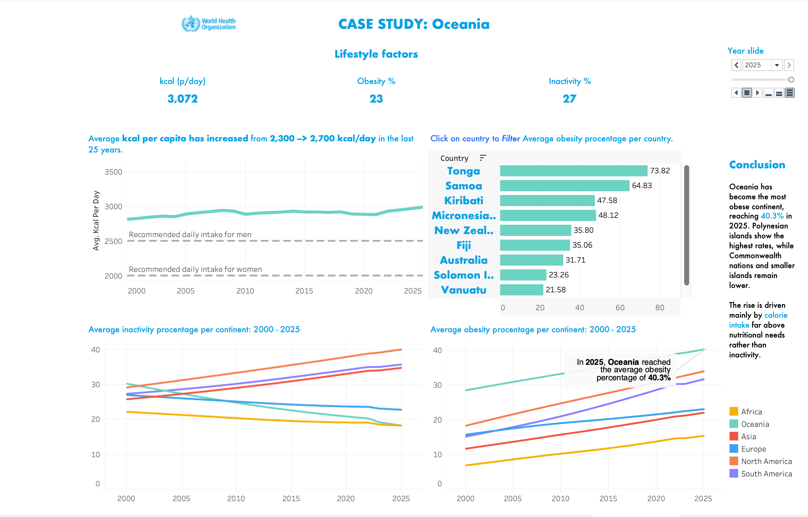

# 🌍 Life Expectancy & Lifestyle Factors: Global Analysis
LifeSpan-Insights-Project
<table>
  <tr>
    <th>Life Expectancy Dashboard</th>
    <th>Africa Dashboard</th>
    <th>Oceania Dashboard</th>
  </tr>
  <tr>
    <td>
       
    </td>
    <td>
       
    </td>
    <td>
       
    </td>
  </tr>
</table>

📘 Project Overview

This project was conducted as a final project for Ironhack to explore how lifestyle factors—including diet, physical activity, smoking, and alcohol consumption—relate to life expectancy across countries and regions from 2000 to 2025.

The goal was to identify global patterns, track improvements over time, and highlight regions facing major health challenges.

📚 Data Sources

Our World in Data (ourworldindata.org
) – datasets on health, diet, alcohol, smoking, obesity, and physical activity

World Health Organization (WHO) (who.int/data
) – life expectancy and health metrics

These datasets were chosen for their reliability, global coverage, and multi-year records.

🔧 Methodology
1. Data Preparation

SQL Integration:

Merged all datasets into a single unified database using year and country (ISO3 codes) as keys.

Columns include lifestyle factors, life expectancy metrics, obesity, calories, salt intake, and GDP.

Data Cleaning & Standardization:

Units standardized (kg/year for diet, daily calories, % for smoking/inactivity)

Missing values handled appropriately

2. Analysis

Descriptive Analysis: Tracked changes in life expectancy, diet, obesity, calories, smoking, alcohol, and sedentary lifestyle over 25 years.

Correlation Analysis: Identified lifestyle factors most strongly associated with life expectancy.

Visualization: Used Python (Pandas, Matplotlib, Seaborn) and Tableau for scatterplots, time series, and bar charts.

🌍 Key Global Trends (2000–2025)

Overall Improvements:

Life expectancy increased in every country.

Vegetable and fruit consumption, daily calories, obesity percentages, and GDP per capita increased.

Smoking decreased globally.

Alcohol and salt intake increased in many countries.

Sedentary lifestyle varied strongly by country.

Regional Highlights:

Region	Observations
Africa	Experienced the largest gains in life expectancy overall.
Central Africa	Life expectancy still below global averages; improvements in caloric intake and diet could boost longevity.
Oceania	Exhibits the highest obesity rates, especially in Polynesian islands, highlighting lifestyle and dietary challenges.

Key Lifestyle Patterns:

Higher calorie intake generally associated with longer life expectancy in regions with low nutrition.

Obesity and inactivity are significant concerns in regions with already high caloric intake.

Smoking reduction correlates with improved life expectancy.

🛠️ Tools & Technologies

SQL – Data merging, cleaning, and creating a unified database

Python (Pandas, Matplotlib, Seaborn) – Data analysis and visualization

Tableau – Interactive dashboards and bar charts for trend exploration

📥 Data Files

merged_lifestyle_life_expectancy.sql – Final SQL database with all merged datasets

correlation_analysis.csv – Correlation results between lifestyle factors and life expectancy

🚀 How to Use

Load the SQL database or CSV into Python or Tableau.

Explore global and regional trends in life expectancy.

Analyze correlations between lifestyle factors and longevity.

Visualize results for specific regions, countries, or global comparisons over time.

💡 Key Takeaways

Life expectancy increased globally over the last 25 years.

Dietary intake, caloric intake, and economic growth contributed to these improvements.

Smoking decreased, but obesity and alcohol consumption rose in certain regions.

Africa shows major improvements, Central Africa still lags, and Oceania has high obesity prevalence.

